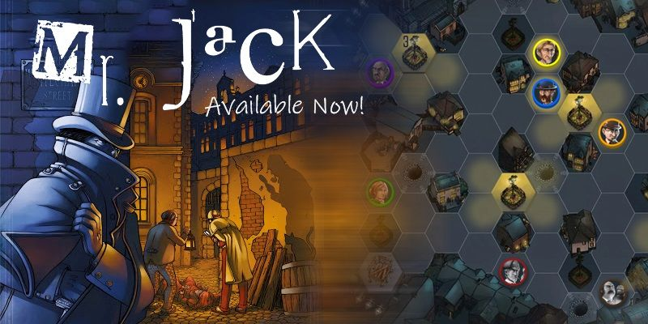
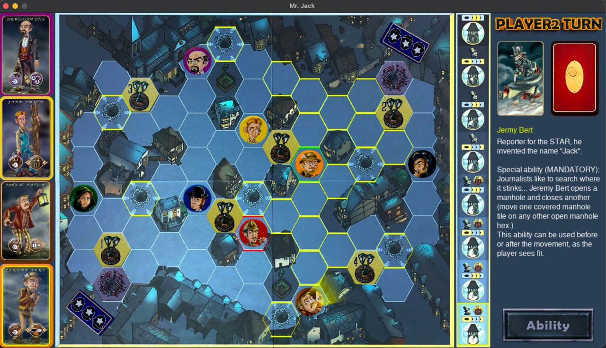
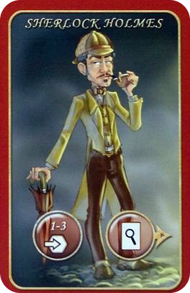
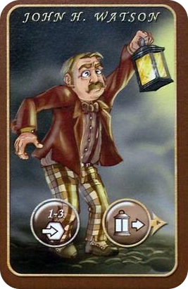
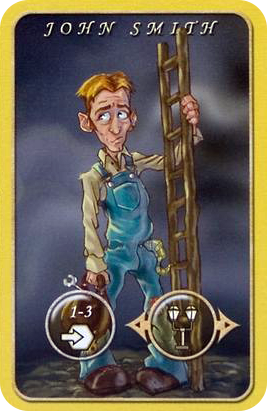
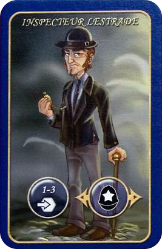
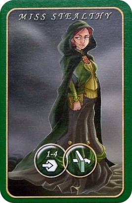
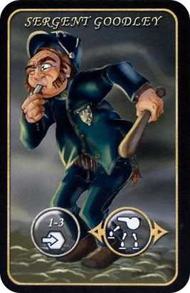
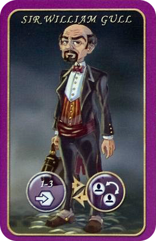
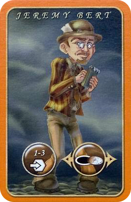

# Mr. Jack

**1888 - London - Whitechapel district**  
The night covers the gloomy alleys with a veil of darkness.
Jack is moving in the shadows... The finest investigators of the gaslight age have gathered here to catch him before he uses the darkness to slip away for good. The trap is slowly closing upon him...
But Jack is cunning. He is in fact impersonating one of the investigators... Will the others unmask him?

A deduction game for 2 players, age 9+, by bruno Cathala and Ludovic Maublanc. 
This project is my final project for the university (AUT) first semester (Fundamentals of Computer and Programming)

The graphics of the program are written using the [SDL2](https://www.libsdl.org/) library (SDL2, SDL2_ttf, SDL2_image) 
And [A simple SDL2 audio library without SDL_Mixer](https://github.com/jakebesworth/Simple-SDL2-Audio) 
AI of the game written with the help of [Monte-Carlo Tree Search for the Mr Jack Board Game](https://www.researchgate.net/publication/276779017_Monte-Carlo_Tree_Search_for_the_Mr_Jack_Board_Game)

[Watch Gameplay](./Gameplay/gameplay.mp4)
 
[Watch AI Gameplay](./Gameplay/AI_gameplay.mp4)

## Rules
[Read Mr. Jack Rulebook](https://cdn.1j1ju.com/medias/42/36/31-mr-jack-rulebook.pdf)

- Call for Witnesses and deeming characters to be innocent is done automatically by the app
- You can play with AI of the game 
- Press CTRL+X on choosing side page and let the AI play with AI and enjoy :D
- Press CTRL+Z to undo your move when you're playing game with AI

## Characters

 **Sherlock Holmes: Movement 1 to 3 hexes THEN ability use**  
The best private detective in the world is on the scene of course, in order to solve the most famous mystery 
**Special ability (MANDATORY):** AFTER MOVEMENT, Sherlock Holmes secretly draws the first card from the alibi pile and places it face down in front of him.

  

**John H. Watson: Movement 1 to 3 hexes THEN ability use**  
Doctor Watson is the faithful sidekick and chronicler of Sherlock Holmes. 
**Special ability (MANDATORY):** Watson bears a lantern, pictured on his character token.
This lantern illuminates all the characters standing straight ahead of him!! (It is important to note that Watson himself is not illumated by the lantern!!)
Any player moving Watson, one way or another, chooses the final facing of the character, and therefore the line illuminated by the lantern.

 

**John Smith: Movement 1 to 3 hexes AND ability use**  
This city lamplighter is in charge of the gaslights that keep on shutting off. 
**Special ability (MANDATORY):** Move one of the lit gaslight tiles onto one of the shut-off gaslight hex. This ability can be used before or after the movement, as the player sees fit.

  

**Inspector Lestrade: Movement 1 to 3 hexes AND ability use**  
This very good sleuth from Scotland Yard was sent to put an end to Jack’s crimes. 
**Special ability (MANDATORY):** Move one police cordon. This will free one of the exits but block another!! This ability can be used before or after the movement, as the player sees fit.

  

**Miss Stealthy: Movement 1 to 4 hexes WITH optional ability use**  
Women are frequently abused in this district and Miss Stealthy is one of the very first fighting to improve the lot of her kind. 
**Special ability (OPTIONAL):** During her movement, Miss Stealthy can cross any hex (building, 4 gaslight, garden) but she must stop her movement on a street hex.

 

**Sergeant Goodley: Movement 1 to 3 hexes AND ability use (whistle)**  
He has a loud whistle that can direct other investigators towards him. 
**Special ability (MANDATORY):** Sergeant Goodley calls for help with his whistle!! You then get 3 movement points to use as you see fit on one or several characters in order to bring them closer to Sergeant Goodley!! This ability can be used before or after the movement, as the player sees fit.

 

**Sir William Gull: Movement 1 to 3 hexes OR ability use**  
The physician of the queen was sent by Her Majesty to lend a hand to the police. 
**Special ability (OPTIONAL):** Instead of moving normally William Gull, you can exchange this character’s location with the location of any other character.

  

**Jeremy Bert: Movement 1 to 3 hexes AND ability use**  
Reporter for the STAR, he invented the name «Jack.» 
**Special ability (MANDATORY):** Journalists like to search where it stinks... Jeremy Bert opens a manhole and closes another (move one covered manhole tile on any other open manhole hex.) This ability can be used before or after the movement, as the player sees fit.

  

  
   <a>Amir Hossein Aghajari</a> • <a href="mailto:amirhossein.aghajari.82@gmail.com">Email</a> • <a href="https://github.com/Aghajari">GitHub</a>

